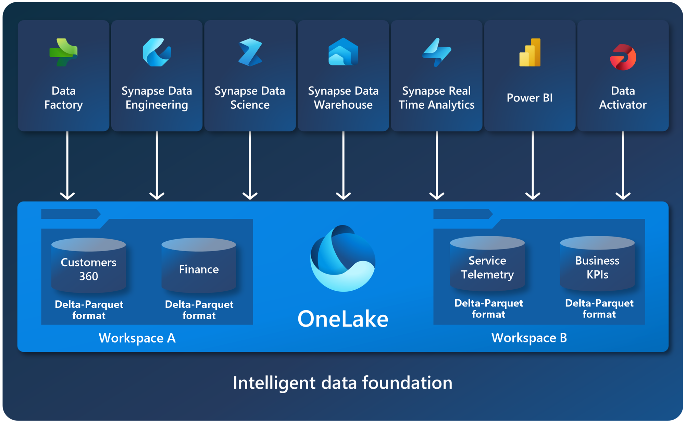
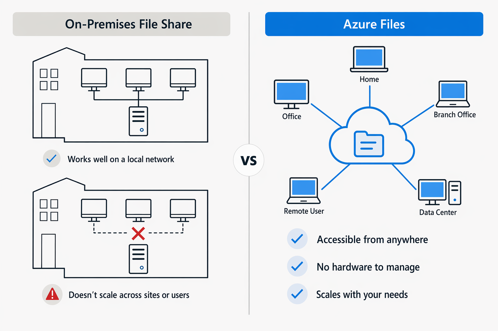
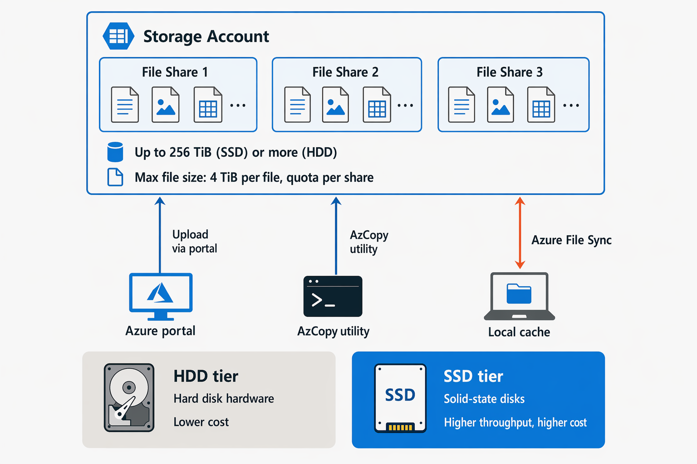
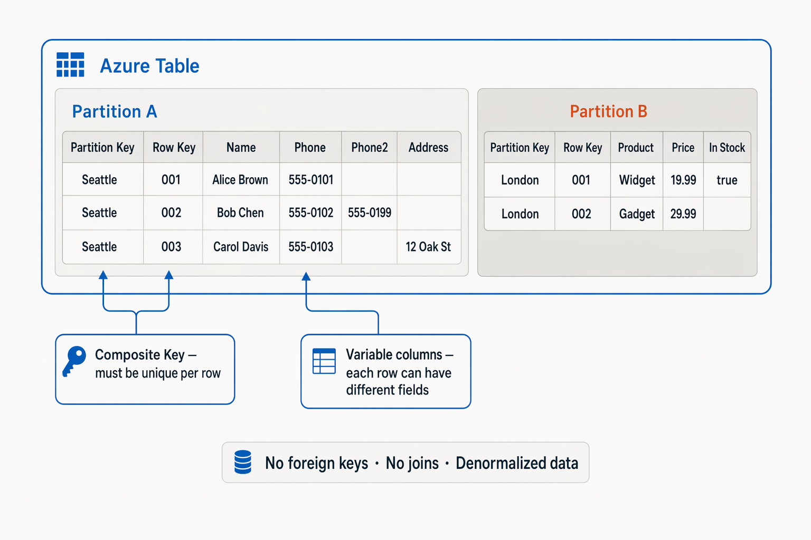
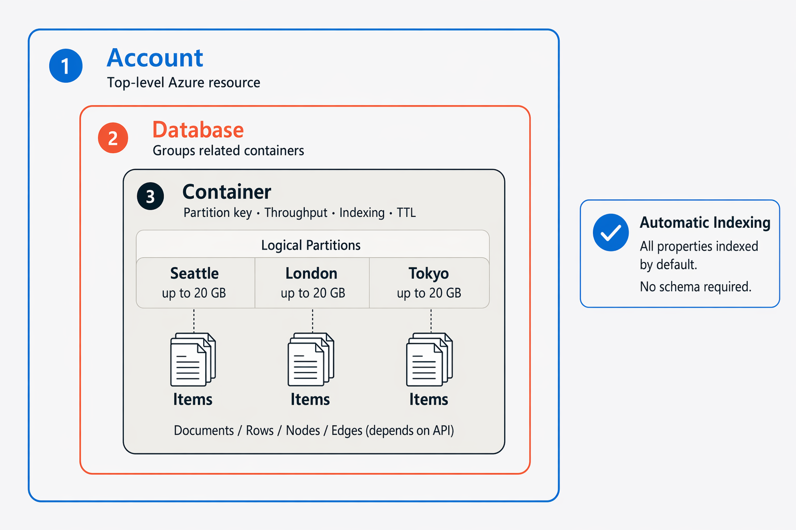
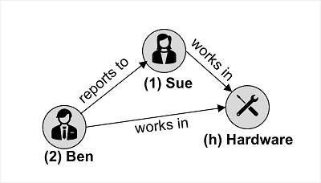

# Descubre Azure Storage para datos no relacionales
# Introducción

La mayoría de las aplicaciones de software necesitan almacenar datos. Con frecuencia, estos datos se almacenan en una base de datos relacional, donde la información se organiza en tablas relacionadas y se administra mediante el lenguaje **Structured Query Language (SQL)**.

Sin embargo, muchas aplicaciones no requieren la estructura rígida de una base de datos relacional y utilizan almacenamiento no relacional (comúnmente conocido como **NoSQL**).

**Azure Storage** y **Microsoft OneLake** ofrecen diversas opciones para almacenar datos en la nube. En este módulo, explorarás las capacidades fundamentales de **Azure Storage** y **Microsoft OneLake**, y aprenderás cómo se utilizan para dar soporte a aplicaciones que requieren almacenes de datos no relacionales.

---

# Explorar Azure Blob Storage

**Azure Blob Storage** es un servicio que permite almacenar grandes cantidades de datos no estructurados en forma de **objetos binarios grandes (blobs)** en la nube.

Los **blobs** son una forma eficiente de almacenar archivos de datos en un formato opti
mizado para el almacenamiento en la nube. Las aplicaciones pueden leer y escribir estos datos mediante la **API de Azure Blob Storage**, lo que facilita su integración con diferentes soluciones y servicios.

En una **cuenta de Azure Storage**, los blobs se almacenan dentro de **contenedores**. Un contenedor proporciona una forma práctica de agrupar blobs relacionados y permite controlar quién puede leer y escribir los datos a nivel de contenedor.

El método de autenticación recomendado es **Microsoft Entra ID**, el servicio de administración de identidades y acceso de Azure. Este permite asignar permisos detallados mediante el **Control de Acceso Basado en Roles de Azure (Azure RBAC)**, que define qué acciones puede realizar cada usuario sobre los recursos de Azure.

Dentro de un contenedor, los blobs pueden organizarse en una **jerarquía de carpetas virtuales**, de forma similar a un sistema de archivos tradicional.

Sin embargo, estas carpetas son únicamente una representación lógica basada en el carácter `/` dentro del nombre del blob. Por defecto:

- No existen como carpetas físicas.
- No es posible aplicar permisos a nivel de carpeta.
- No se pueden realizar operaciones masivas sobre una carpeta.

## Tipos de blobs en Azure Blob Storage

Azure Blob Storage admite **tres tipos de blobs**, cada uno diseñado para diferentes escenarios de uso.

### Blobs de bloques (Block Blobs)

Los **blobs de bloques** almacenan los datos como un conjunto de bloques independientes.

**Características:**

- Cada bloque puede tener un tamaño de hasta **4.000 MiB**.
- Un blob puede contener hasta **50.000 bloques**.
- Tamaño máximo aproximado: **190,7 TiB**.
- El bloque es la unidad mínima que puede leerse o escribirse.

**Casos de uso:**

- Imágenes.
- Documentos.
- Vídeos.
- Copias de seguridad.
- Archivos grandes que cambian con poca frecuencia.

### Blobs de páginas (Page Blobs)

Los **blobs de páginas** organizan la información en páginas de tamaño fijo de **512 bytes**.

**Características:**

- Permiten operaciones aleatorias de lectura y escritura.
- Es posible modificar una única página sin afectar al resto del blob.
- Tamaño máximo: **8 TB**.

**Casos de uso:**

- Discos virtuales de máquinas virtuales de Azure (VHD).
- Aplicaciones que requieren acceso aleatorio a los datos.

### Blobs de anexo (Append Blobs)

Los **blobs de anexo** son una variante de los blobs de bloques optimizada para agregar información al final del archivo.

**Características:**

- Solo permiten añadir nuevos bloques al final del blob.
- No es posible modificar ni eliminar bloques existentes.
- Cada bloque puede tener un tamaño de hasta **4 MB**.
- Tamaño máximo aproximado: **195 GB**.

**Casos de uso:**

- Archivos de registro (logs).
- Auditorías.
- Eventos generados continuamente.

## Niveles de acceso de Azure Blob Storage

Azure Blob Storage ofrece **cuatro niveles de acceso** que permiten equilibrar el coste de almacenamiento y la velocidad de acceso a los datos.

### Nivel Hot (Caliente)

Es el **nivel predeterminado** y está diseñado para blobs a los que se accede con frecuencia.

**Características:**

- Almacenamiento en medios de alto rendimiento.
- Baja latencia de acceso.
- Mayor coste de almacenamiento.
- Menor coste por operaciones de lectura.

**Casos de uso:**

- Datos utilizados diariamente.
- Archivos de aplicaciones activas.
- Contenido multimedia de uso frecuente.

### Nivel Cool (Frío)

Está pensado para datos que se consultan con poca frecuencia, pero que aún deben estar disponibles rápidamente.

**Características:**

- Menor coste de almacenamiento que el nivel Hot.
- Mayor coste de acceso a los datos.
- Los datos deben permanecer al menos **30 días** para evitar penalizaciones por eliminación anticipada.
- Los blobs pueden moverse entre los niveles **Hot** y **Cool** cuando cambian los patrones de acceso.

**Casos de uso:**

- Archivos que dejan de utilizarse con frecuencia.
- Copias de seguridad recientes.
- Documentos de consulta ocasional.

### Nivel Cold

El nivel **Cold** está optimizado para almacenar datos que rara vez se acceden o modifican, pero que aún requieren una recuperación relativamente rápida.

**Características:**

- Coste de almacenamiento inferior al nivel Cool.
- Coste de acceso superior al nivel Cool.
- Los datos deben permanecer un mínimo de **90 días** para evitar penalizaciones por eliminación anticipada.

**Casos de uso:**

- Copias de seguridad a corto plazo.
- Datos para recuperación ante desastres.
- Grandes volúmenes de información que necesitan un almacenamiento económico.

### Nivel Archive (Archivo)

Es el nivel con el **menor coste de almacenamiento**, pero también con la **mayor latencia de acceso**.

**Características:**

- Diseñado para datos históricos o de archivo.
- Los datos permanecen almacenados **offline**.
- Deben mantenerse al menos **180 días** para evitar penalizaciones por eliminación anticipada.
- La recuperación puede tardar **hasta 15 horas**.

Para acceder a un blob archivado, primero es necesario cambiar su nivel de acceso a **Hot**, **Cool** o **Cold**. Este proceso se conoce como **rehidratación** (*rehydration*), y el blob solo estará disponible una vez finalice.

**Casos de uso:**

- Datos históricos.
- Registros que deben conservarse por motivos legales.
- Información a la que se accede muy raramente.

## Administración del ciclo de vida y redundancia de Azure Blob Storage

Azure Blob Storage permite crear **políticas de administración del ciclo de vida** para automatizar la gestión de los blobs según su antigüedad y frecuencia de uso.

Estas políticas pueden:

- Mover automáticamente un blob del nivel **Hot** al nivel **Cool**, posteriormente al nivel **Cold** y finalmente al nivel **Archive**.
- Basar las transiciones en el número de días transcurridos desde la última modificación del blob.
- Eliminar automáticamente blobs obsoletos cuando ya no sean necesarios.

Gracias a estas políticas es posible reducir los costes de almacenamiento sin necesidad de administrar manualmente los datos.

## Opciones de redundancia

Azure Storage incorpora diferentes opciones de **redundancia** para garantizar la alta disponibilidad y la protección de los datos frente a fallos.

### LRS (Local Redundant Storage)

El **Almacenamiento con Redundancia Local (LRS)** mantiene **tres copias** de los datos dentro de un único centro de datos.

**Ventajas:**

- Protección frente a fallos de hardware locales.
- Es la opción más económica.

### ZRS (Zone-Redundant Storage)

El **Almacenamiento con Redundancia entre Zonas (ZRS)** replica los datos entre **tres zonas de disponibilidad** dentro de la región principal.

**Ventajas:**

- Los datos permanecen disponibles incluso si una zona completa deja de funcionar.
- Mayor disponibilidad que LRS.

### GRS (Geo-Redundant Storage)

El **Almacenamiento con Redundancia Geográfica (GRS)** replica de forma asíncrona los datos a una **región secundaria**, situada a cientos de kilómetros de la región principal.

**Ventajas:**

- Protección frente a desastres que afecten a toda una región.
- Permite recuperar los datos en caso de fallo regional.

### GZRS (Geo-Zone-Redundant Storage)

El **Almacenamiento con Redundancia Geográfica entre Zonas (GZRS)** combina las ventajas de **ZRS** y **GRS**.

**Ventajas:**

- Replica los datos entre varias zonas de disponibilidad de la región principal.
- Además, mantiene una copia en una región secundaria para proteger frente a desastres regionales.

### RA-GRS y RA-GZRS

Las opciones **RA-GRS** (*Read-Access Geo-Redundant Storage*) y **RA-GZRS** permiten **leer datos desde la región secundaria** incluso antes de que se produzca un cambio por error (*failover*).

Esto resulta útil para:

- Consultas de solo lectura.
- Mejorar la disponibilidad de las aplicaciones.
- Mantener el acceso a los datos durante incidencias en la región principal.

---

# Explore Azure Data Lake Storage Gen2

Azure Data Lake Storage Gen2 es una solución de data lake a escala en la nube integrada en Azure Storage. Combina la escalabilidad y el control de costes de Azure Blob Storage —incluyendo niveles de almacenamiento y gestión del ciclo de vida— con un sistema de archivos jerárquico compatible con los principales sistemas analíticos.

Sistemas como Azure Databricks pueden montar un sistema de archivos distribuido alojado en Azure Data Lake Storage Gen2 y utilizarlo para procesar enormes volúmenes de datos. Los tenants de Microsoft Fabric provisionan automáticamente OneLake, que se construye sobre Azure Data Lake Storage Gen2.

El espacio de nombres jerárquico también permite listas de control de acceso (ACLs) compatibles con POSIX, por lo que puedes establecer permisos de lectura, escritura y ejecución de grano fino en archivos y carpetas individuales, separados del modelo más amplio de control de acceso basado en roles (RBAC) de Azure.

Para crear un sistema de archivos Azure Data Lake Storage Gen2, debes habilitar la opción de Espacio de nombres Jerárquico de una cuenta de Azure Storage. Puedes hacer esto al crear inicialmente la cuenta de almacenamiento, o puedes actualizar una cuenta de Azure Storage existente para que soporte un espacio de nombres jerárquico. Ten en cuenta que actualizar es un proceso unidireccional: después de actualizar, no puedes revertir la cuenta de almacenamiento a un espacio de nombres plano.

---

# Explora Microsoft OneLake en Fabric

Microsoft Fabric proviene automáticamente OneLake, basado en Azure Data Lake Gen 2.

OneLake es un único lago de datos unificado y lógico diseñado para toda tu organización. OneLake viene automáticamente con todos los tenants de Microsoft Fabric y sirve como el repositorio central de todos tus datos de analítica. Ya sea estructurado o no, OneLake soporta cualquier tipo de archivo y permite usar los mismos datos a través de múltiples motores analíticos sin movimientos ni duplicaciones de datos.

Principales beneficios de OneLake
Lago de datos a nivel organizativo Antes de OneLake, era común crear múltiples data lakes para diferentes grupos empresariales. Ahora, OneLake ofrece una solución colaborativa, asegurando que toda tu organización comparta un único lago de datos.

Propiedad distribuida y colaboración Dentro de un inquilino, puedes crear espacios de trabajo, permitiendo que diferentes partes de tu organización gestionen sus datos. Esta propiedad distribuida fomenta la colaboración manteniendo los límites de gobernanza.

Abierto y compatible Construido sobre Azure Data Lake Storage (ADLS) Gen2, OneLake almacena datos en formato Delta Parquet, un formato de archivo abierto y eficiente ampliamente utilizado para datos analíticos. Soporta las APIs y SDKs ADLS Gen2 existentes, lo que lo hace compatible con tus aplicaciones actuales.

Fácil de navegar Es sencillo navegar por los datos de OneLake desde Windows usando el explorador de archivos de OneLake.

---

# Explorar Azure Files

Muchos sistemas locales que comprenden una red de ordenadores internos utilizan compartición de archivos. Un recurso compartido permite almacenar un archivo en un ordenador y conceder acceso a ese archivo a usuarios y aplicaciones que se ejecuten en otros ordenadores. Esta estrategia puede funcionar bien para ordenadores en la misma red local, pero no escala bien a medida que aumenta el número de usuarios o si los usuarios están ubicados en diferentes sitios.

Azure Files es esencialmente una forma de crear compartidos de red basados en la nube, como los que suele encontrarse en organizaciones locales, para poner documentos y otros archivos a disposición de múltiples usuarios. Al alojar compartidos de archivos en Azure, las organizaciones pueden eliminar costes de hardware y gastos de mantenimiento, y beneficiarse de una alta disponibilidad y almacenamiento escalable en la nube para los archivos.

Creas almacenamiento de archivos en Azure en una cuenta de almacenamiento. Azure Files te permite compartir grandes cantidades de datos en una sola cuenta de almacenamiento — hasta 256 TiB para cuentas basadas en SSD, y aún más para cuentas basadas en HDD. Estos datos pueden distribuirse entre cualquier número de archivos compartidos en la cuenta. El tamaño máximo de un único archivo es de 4 TiB, pero puedes establecer cuotas para limitar el tamaño de cada acción por debajo de esta cifra. Actualmente, Azure File Storage soporta hasta 2.000 handle concurrentes por archivo o directorio.

Después de crear una cuenta de almacenamiento, puedes subir archivos a Azure File Storage usando el portal Azure o herramientas como la utilidad AzCopy. También puedes usar el servicio Azure File Sync para sincronizar copias en caché local de archivos compartidos con los datos en Azure File Storage.

Azure File Storage ofrece dos niveles de medios. La capa HDD utiliza hardware basado en discos duros en un centro de datos, y la capa SSD utiliza discos de estado sólido. El nivel SSD ofrece mayor capacidad de rendimiento, pero se cobra a un precio más alto.

Azure Files soporta dos protocolos comunes de intercambio de archivos en red:

El intercambio de archivos Server Message Block (SMB) se utiliza comúnmente en varios sistemas operativos (Windows, Linux, macOS).

Los recursos compartidos del Sistema de Archivos de Red (NFS) son usados por Linux (kernel 4.3 o posterior). Los compartidas de archivos NFS Azure no son compatibles en Windows ni macOS. Para crear un recurso compartido NFS, debes usar una cuenta de almacenamiento de nivel SSD y crear y configurar una red virtual a través de la cual se pueda controlar el acceso al conjunto.

---

# Explore Azure Tables

Azure Table Storage es una solución de almacenamiento NoSQL que utiliza tablas que contienen elementos clave/valor de datos. Cada elemento está representado por una fila que contiene columnas para los campos de datos que deben almacenarse.

Sin embargo, no te dejes engañar pensando que una tabla de almacenamiento de tablas de Azure es como una tabla en una base de datos relacional. Una tabla Azure te permite almacenar datos semiestructurados. Todas las filas de una tabla deben tener una clave única (compuesta por una clave de partición y una clave de fila), y cuando se modifican datos en una tabla, una columna de marca de tiempo registra la fecha y hora en que se realizó la modificación; Pero aparte de eso, las columnas de cada fila pueden variar. Las tablas de almacenamiento de Azure Table no tienen concepto de claves foráneas, relaciones, procedimientos almacenados, vistas u otros objetos que puedas encontrar en una base de datos relacional.

Los datos en el almacenamiento de Azure Table suelen estar desnormalizados, y cada fila contiene todos los datos para una entidad lógica. Por ejemplo, una tabla que contiene información del cliente podría almacenar el nombre de pila, el apellido, uno o más números de teléfono y una o más direcciones para cada cliente. El número de campos en cada fila puede variar, dependiendo del número de números de teléfono y direcciones para cada cliente, y de los detalles registrados para cada dirección. En una base de datos relacional, esta información se dividiría en varias filas de varias tablas.

Para ayudar a garantizar un acceso rápido, Azure Table Storage divide una tabla en particiones. La partición es un mecanismo para agrupar filas relacionadas basándose en la PartitionKey — un valor que eliges para reflejar una propiedad compartida de filas relacionadas. Las filas que comparten la misma clave de partición se almacenan juntas. La partición no solo ayuda a organizar los datos, sino que también puede mejorar la escalabilidad y el rendimiento de las siguientes maneras:

Las particiones son independientes entre sí y pueden crecer o reducirse a medida que se añaden filas o se eliminan de una partición. Una tabla puede contener cualquier número de particiones.

Cuando buscas datos, puedes incluir la clave de partición en los criterios de búsqueda. Esto ayuda a reducir el volumen de datos a examinar y mejora el rendimiento al reducir la cantidad de E/S (operaciones de entrada y salida, o lecturas y escrituras) necesarias para localizar los datos.

La clave en una tabla de almacenamiento de Azure Table consta de dos elementos; la clave de partición que identifica la partición que contiene la fila, y una clave de fila única para cada fila de la misma partición. Los elementos de la misma partición se almacenan en orden de fila de clave. Si una aplicación añade una nueva fila a una tabla, Azure se asegura de que la fila esté colocada en la posición correcta de la tabla. Este esquema permite a una aplicación realizar rápidamente consultas puntuales que identifican una sola fila, y consultas por rango que obtienen un bloque contiguo de filas en una partición.

# 🚀 Azure Cosmos DB
 
 
# 🧠 1. Introducción
 
Las bases de datos relacionales son rígidas.
 
NoSQL permite:
 
- 📄 Documentos
- 🔑 Clave-valor
- 🕸️ Grafos
- 📊 Columnas
 
---
 
# ⚙️ 2. Arquitectura de Cosmos DB
 
## 🏗️ Estructura
 
1. Cuenta  
2. Base de datos  
3. Contenedor  
4. Items  
 
---
 
## 🖼️ Imagen arquitectura
 

 
---
 
# 🔑 3. Particiones (CLAVE DE EXAMEN)
 
- Divide datos en particiones lógicas
- Cada partición → 20 GB máximo
- Clave de partición = rendimiento
 
❌ Mala clave = hot partitions  
✔ Buena clave = escalabilidad
 
---
 
# 🌍 4. Distribución global
 
- Replicación automática
- Multi-región
- Baja latencia global
 
---
 
## 🖼️ Imagen global
 

 
---
 
# 📏 5. Consistencia
 
| Nivel | Descripción |
|------|-------------|
| 🔴 Fuerte | siempre actualizado |
| 🟠 Estancamiento acotado | retraso controlado |
| 🟡 Sesión | ⭐ recomendado |
| 🔵 Prefijo consistente | orden garantizado |
| ⚪ Eventual | alta disponibilidad |
 
---
 
# 💰 6. RU/s
 
- 1 RU ≈ lectura de 1 KB
- Todo consume RU
 
---
 
# ⚙️ 7. Modelos de rendimiento
 
| Modelo | Descripción |
|--------|-------------|
| 🟢 Dedicado | un contenedor |
| 🟡 Compartido | hasta 25 contenedores |
| 🔵 Serverless | pago por uso |
 
---
 
## 🖼️ Imagen rendimiento
 

 
---
 
# 🔌 8. APIs de Cosmos DB
 
:contentReference[oaicite:1]{index=1} soporta:
 
- NoSQL
- MongoDB
- Table
- Cassandra
- Gremlin
 
---
 
## 🖼️ Imagen APIs
 

 
---
 
# 🕸️ 9. Gremlin (Grafos)
 
- Vértices = nodos
- Aristas = relaciones
 
---
 
## 🖼️ Imagen grafos
 

 
---
 
# 📌 10. Cuándo usar Cosmos DB
 
✔ IoT 📡  
✔ Gaming 🎮  
✔ E-commerce 🛒  
✔ Apps web/móviles 📱  
 
---
 
# ❌ 11. Cuándo NO usarlo
 
- ❌ JOINs complejos → Azure SQL Database
- ❌ Analítica histórica → Azure Synapse / Fabric
 
---
 
# 🧠 12. RESUMEN FINAL
 
:contentReference[oaicite:2]{index=2} es:
 
✔ Global  
✔ NoSQL  
✔ Multi-API  
✔ Escalable  
✔ Baja latencia  
✔ Basado en RU/s 
