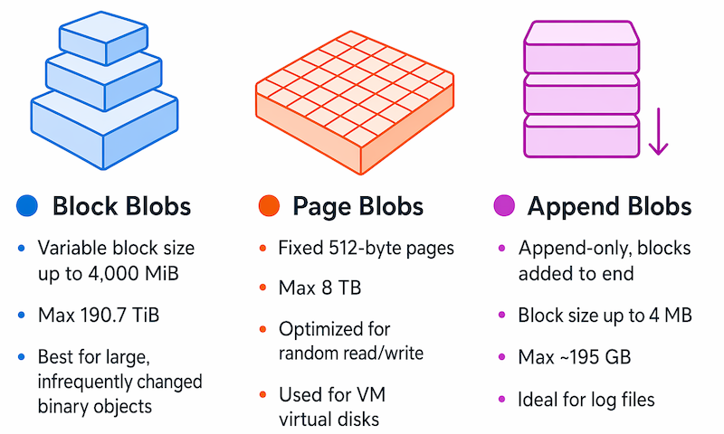
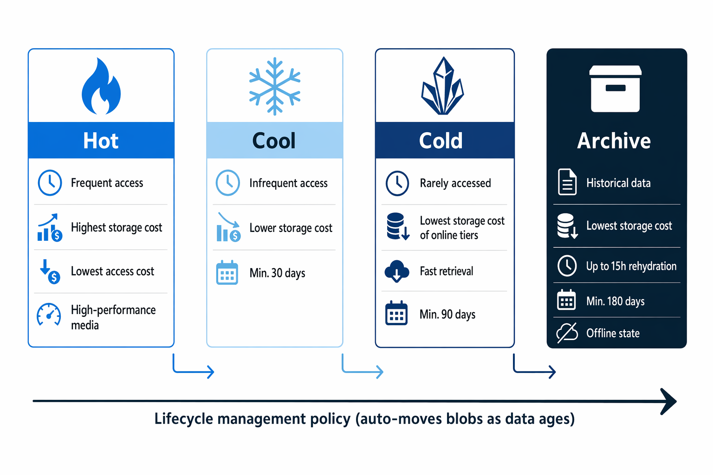
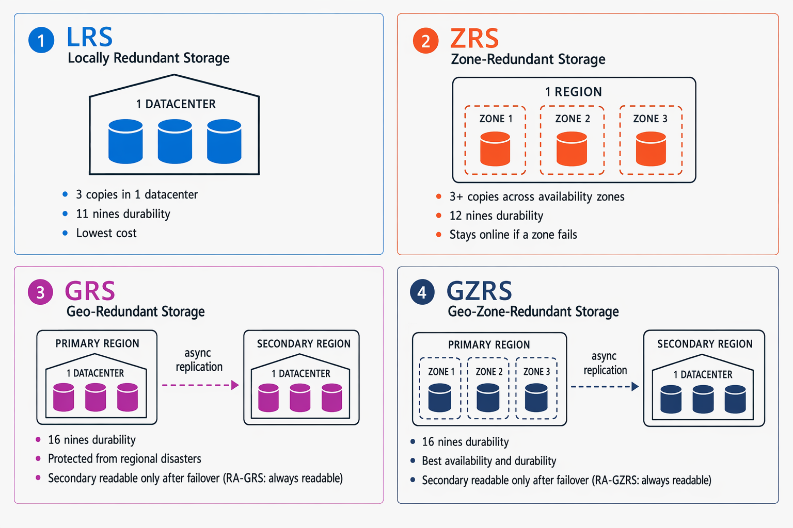

# Introducción

La mayoría de las aplicaciones de software necesitan almacenar datos. Con frecuencia, estos datos se almacenan en una base de datos relacional, donde la información se organiza en tablas relacionadas y se administra mediante el lenguaje **Structured Query Language (SQL)**.

Sin embargo, muchas aplicaciones no requieren la estructura rígida de una base de datos relacional y utilizan almacenamiento no relacional (comúnmente conocido como **NoSQL**).

**Azure Storage** y **Microsoft OneLake** ofrecen diversas opciones para almacenar datos en la nube. En este módulo, explorarás las capacidades fundamentales de **Azure Storage** y **Microsoft OneLake**, y aprenderás cómo se utilizan para dar soporte a aplicaciones que requieren almacenes de datos no relacionales.

---

# Explorar Azure Blob Storage

**Azure Blob Storage** es un servicio que permite almacenar grandes cantidades de datos no estructurados en forma de **objetos binarios grandes (blobs)** en la nube.

Los **blobs** son una forma eficiente de almacenar archivos de datos en un formato opti
mizado para el almacenamiento en la nube. Las aplicaciones pueden leer y escribir estos datos mediante la **API de Azure Blob Storage**, lo que facilita su integración con diferentes soluciones y servicios.

En una **cuenta de Azure Storage**, los blobs se almacenan dentro de **contenedores**. Un contenedor proporciona una forma práctica de agrupar blobs relacionados y permite controlar quién puede leer y escribir los datos a nivel de contenedor.

El método de autenticación recomendado es **Microsoft Entra ID**, el servicio de administración de identidades y acceso de Azure. Este permite asignar permisos detallados mediante el **Control de Acceso Basado en Roles de Azure (Azure RBAC)**, que define qué acciones puede realizar cada usuario sobre los recursos de Azure.

Dentro de un contenedor, los blobs pueden organizarse en una **jerarquía de carpetas virtuales**, de forma similar a un sistema de archivos tradicional.

Sin embargo, estas carpetas son únicamente una representación lógica basada en el carácter `/` dentro del nombre del blob. Por defecto:

- No existen como carpetas físicas.
- No es posible aplicar permisos a nivel de carpeta.
- No se pueden realizar operaciones masivas sobre una carpeta.

## Tipos de blobs en Azure Blob Storage

Azure Blob Storage admite **tres tipos de blobs**, cada uno diseñado para diferentes escenarios de uso.

### Blobs de bloques (Block Blobs)

Los **blobs de bloques** almacenan los datos como un conjunto de bloques independientes.

**Características:**

- Cada bloque puede tener un tamaño de hasta **4.000 MiB**.
- Un blob puede contener hasta **50.000 bloques**.
- Tamaño máximo aproximado: **190,7 TiB**.
- El bloque es la unidad mínima que puede leerse o escribirse.

**Casos de uso:**

- Imágenes.
- Documentos.
- Vídeos.
- Copias de seguridad.
- Archivos grandes que cambian con poca frecuencia.

### Blobs de páginas (Page Blobs)

Los **blobs de páginas** organizan la información en páginas de tamaño fijo de **512 bytes**.

**Características:**

- Permiten operaciones aleatorias de lectura y escritura.
- Es posible modificar una única página sin afectar al resto del blob.
- Tamaño máximo: **8 TB**.

**Casos de uso:**

- Discos virtuales de máquinas virtuales de Azure (VHD).
- Aplicaciones que requieren acceso aleatorio a los datos.

### Blobs de anexo (Append Blobs)

Los **blobs de anexo** son una variante de los blobs de bloques optimizada para agregar información al final del archivo.

**Características:**

- Solo permiten añadir nuevos bloques al final del blob.
- No es posible modificar ni eliminar bloques existentes.
- Cada bloque puede tener un tamaño de hasta **4 MB**.
- Tamaño máximo aproximado: **195 GB**.

**Casos de uso:**

- Archivos de registro (logs).
- Auditorías.
- Eventos generados continuamente.

## Niveles de acceso de Azure Blob Storage

Azure Blob Storage ofrece **cuatro niveles de acceso** que permiten equilibrar el coste de almacenamiento y la velocidad de acceso a los datos.

### Nivel Hot (Caliente)

Es el **nivel predeterminado** y está diseñado para blobs a los que se accede con frecuencia.

**Características:**

- Almacenamiento en medios de alto rendimiento.
- Baja latencia de acceso.
- Mayor coste de almacenamiento.
- Menor coste por operaciones de lectura.

**Casos de uso:**

- Datos utilizados diariamente.
- Archivos de aplicaciones activas.
- Contenido multimedia de uso frecuente.

### Nivel Cool (Frío)

Está pensado para datos que se consultan con poca frecuencia, pero que aún deben estar disponibles rápidamente.

**Características:**

- Menor coste de almacenamiento que el nivel Hot.
- Mayor coste de acceso a los datos.
- Los datos deben permanecer al menos **30 días** para evitar penalizaciones por eliminación anticipada.
- Los blobs pueden moverse entre los niveles **Hot** y **Cool** cuando cambian los patrones de acceso.

**Casos de uso:**

- Archivos que dejan de utilizarse con frecuencia.
- Copias de seguridad recientes.
- Documentos de consulta ocasional.

### Nivel Cold

El nivel **Cold** está optimizado para almacenar datos que rara vez se acceden o modifican, pero que aún requieren una recuperación relativamente rápida.

**Características:**

- Coste de almacenamiento inferior al nivel Cool.
- Coste de acceso superior al nivel Cool.
- Los datos deben permanecer un mínimo de **90 días** para evitar penalizaciones por eliminación anticipada.

**Casos de uso:**

- Copias de seguridad a corto plazo.
- Datos para recuperación ante desastres.
- Grandes volúmenes de información que necesitan un almacenamiento económico.

### Nivel Archive (Archivo)

Es el nivel con el **menor coste de almacenamiento**, pero también con la **mayor latencia de acceso**.

**Características:**

- Diseñado para datos históricos o de archivo.
- Los datos permanecen almacenados **offline**.
- Deben mantenerse al menos **180 días** para evitar penalizaciones por eliminación anticipada.
- La recuperación puede tardar **hasta 15 horas**.

Para acceder a un blob archivado, primero es necesario cambiar su nivel de acceso a **Hot**, **Cool** o **Cold**. Este proceso se conoce como **rehidratación** (*rehydration*), y el blob solo estará disponible una vez finalice.

**Casos de uso:**

- Datos históricos.
- Registros que deben conservarse por motivos legales.
- Información a la que se accede muy raramente.

## Administración del ciclo de vida y redundancia de Azure Blob Storage

Azure Blob Storage permite crear **políticas de administración del ciclo de vida** para automatizar la gestión de los blobs según su antigüedad y frecuencia de uso.

Estas políticas pueden:

- Mover automáticamente un blob del nivel **Hot** al nivel **Cool**, posteriormente al nivel **Cold** y finalmente al nivel **Archive**.
- Basar las transiciones en el número de días transcurridos desde la última modificación del blob.
- Eliminar automáticamente blobs obsoletos cuando ya no sean necesarios.

Gracias a estas políticas es posible reducir los costes de almacenamiento sin necesidad de administrar manualmente los datos.

## Opciones de redundancia

Azure Storage incorpora diferentes opciones de **redundancia** para garantizar la alta disponibilidad y la protección de los datos frente a fallos.

### LRS (Local Redundant Storage)

El **Almacenamiento con Redundancia Local (LRS)** mantiene **tres copias** de los datos dentro de un único centro de datos.

**Ventajas:**

- Protección frente a fallos de hardware locales.
- Es la opción más económica.

### ZRS (Zone-Redundant Storage)

El **Almacenamiento con Redundancia entre Zonas (ZRS)** replica los datos entre **tres zonas de disponibilidad** dentro de la región principal.

**Ventajas:**

- Los datos permanecen disponibles incluso si una zona completa deja de funcionar.
- Mayor disponibilidad que LRS.

### GRS (Geo-Redundant Storage)

El **Almacenamiento con Redundancia Geográfica (GRS)** replica de forma asíncrona los datos a una **región secundaria**, situada a cientos de kilómetros de la región principal.

**Ventajas:**

- Protección frente a desastres que afecten a toda una región.
- Permite recuperar los datos en caso de fallo regional.

### GZRS (Geo-Zone-Redundant Storage)

El **Almacenamiento con Redundancia Geográfica entre Zonas (GZRS)** combina las ventajas de **ZRS** y **GRS**.

**Ventajas:**

- Replica los datos entre varias zonas de disponibilidad de la región principal.
- Además, mantiene una copia en una región secundaria para proteger frente a desastres regionales.

### RA-GRS y RA-GZRS

Las opciones **RA-GRS** (*Read-Access Geo-Redundant Storage*) y **RA-GZRS** permiten **leer datos desde la región secundaria** incluso antes de que se produzca un cambio por error (*failover*).

Esto resulta útil para:

- Consultas de solo lectura.
- Mejorar la disponibilidad de las aplicaciones.
- Mantener el acceso a los datos durante incidencias en la región principal.

---
