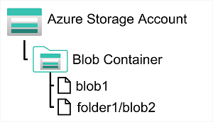

# Introducción

La mayoría de las aplicaciones de software necesitan almacenar datos. Con frecuencia, estos datos se almacenan en una base de datos relacional, donde la información se organiza en tablas relacionadas y se administra mediante el lenguaje **Structured Query Language (SQL)**.

Sin embargo, muchas aplicaciones no requieren la estructura rígida de una base de datos relacional y utilizan almacenamiento no relacional (comúnmente conocido como **NoSQL**).

**Azure Storage** y **Microsoft OneLake** ofrecen diversas opciones para almacenar datos en la nube. En este módulo, explorarás las capacidades fundamentales de **Azure Storage** y **Microsoft OneLake**, y aprenderás cómo se utilizan para dar soporte a aplicaciones que requieren almacenes de datos no relacionales.

---

# Explorar Azure Blob Storage

**Azure Blob Storage** es un servicio que permite almacenar grandes cantidades de datos no estructurados en forma de **objetos binarios grandes (blobs)** en la nube.

Los **blobs** son una forma eficiente de almacenar archivos de datos en un formato opti
mizado para el almacenamiento en la nube. Las aplicaciones pueden leer y escribir estos datos mediante la **API de Azure Blob Storage**, lo que facilita su integración con diferentes soluciones y servicios.

En una **cuenta de Azure Storage**, los blobs se almacenan dentro de **contenedores**. Un contenedor proporciona una forma práctica de agrupar blobs relacionados y permite controlar quién puede leer y escribir los datos a nivel de contenedor.

El método de autenticación recomendado es **Microsoft Entra ID**, el servicio de administración de identidades y acceso de Azure. Este permite asignar permisos detallados mediante el **Control de Acceso Basado en Roles de Azure (Azure RBAC)**, que define qué acciones puede realizar cada usuario sobre los recursos de Azure.

Dentro de un contenedor, los blobs pueden organizarse en una **jerarquía de carpetas virtuales**, de forma similar a un sistema de archivos tradicional.

Sin embargo, estas carpetas son únicamente una representación lógica basada en el carácter `/` dentro del nombre del blob. Por defecto:

- No existen como carpetas físicas.
- No es posible aplicar permisos a nivel de carpeta.
- No se pueden realizar operaciones masivas sobre una carpeta.

## Tipos de blobs en Azure Blob Storage

Azure Blob Storage admite **tres tipos de blobs**, cada uno diseñado para diferentes escenarios de uso.

### Blobs de bloques (Block Blobs)

Los **blobs de bloques** almacenan los datos como un conjunto de bloques independientes.

**Características:**

- Cada bloque puede tener un tamaño de hasta **4.000 MiB**.
- Un blob puede contener hasta **50.000 bloques**.
- Tamaño máximo aproximado: **190,7 TiB**.
- El bloque es la unidad mínima que puede leerse o escribirse.

**Casos de uso:**

- Imágenes.
- Documentos.
- Vídeos.
- Copias de seguridad.
- Archivos grandes que cambian con poca frecuencia.

### Blobs de páginas (Page Blobs)

Los **blobs de páginas** organizan la información en páginas de tamaño fijo de **512 bytes**.

**Características:**

- Permiten operaciones aleatorias de lectura y escritura.
- Es posible modificar una única página sin afectar al resto del blob.
- Tamaño máximo: **8 TB**.

**Casos de uso:**

- Discos virtuales de máquinas virtuales de Azure (VHD).
- Aplicaciones que requieren acceso aleatorio a los datos.

### Blobs de anexo (Append Blobs)

Los **blobs de anexo** son una variante de los blobs de bloques optimizada para agregar información al final del archivo.

**Características:**

- Solo permiten añadir nuevos bloques al final del blob.
- No es posible modificar ni eliminar bloques existentes.
- Cada bloque puede tener un tamaño de hasta **4 MB**.
- Tamaño máximo aproximado: **195 GB**.

**Casos de uso:**

- Archivos de registro (logs).
- Auditorías.
- Eventos generados continuamente.

---
